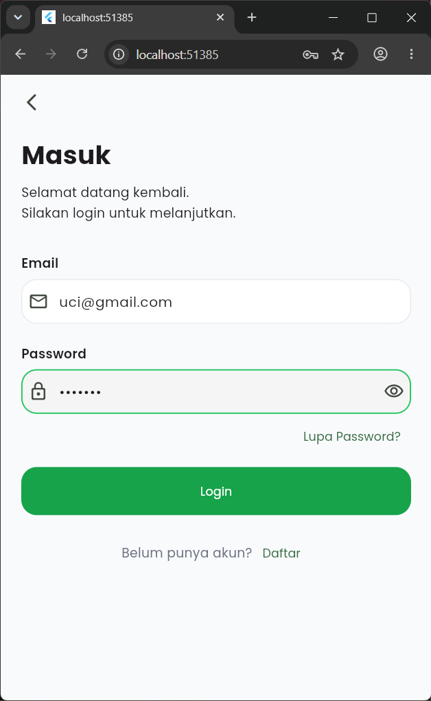
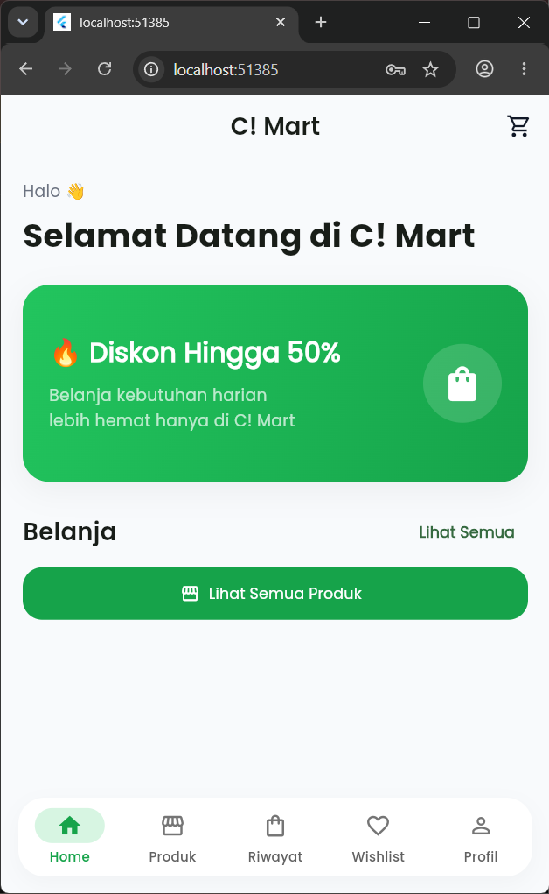
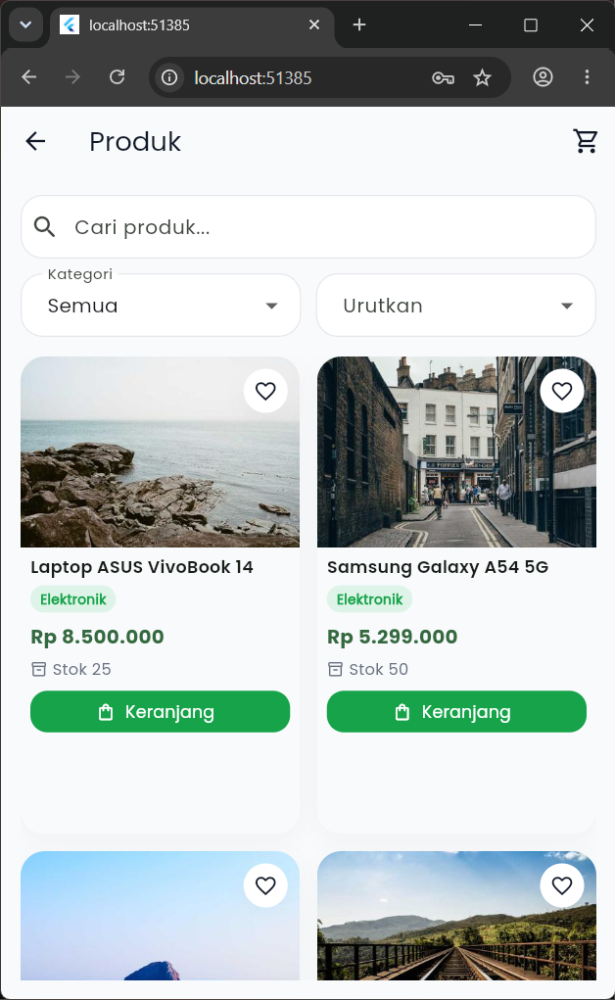
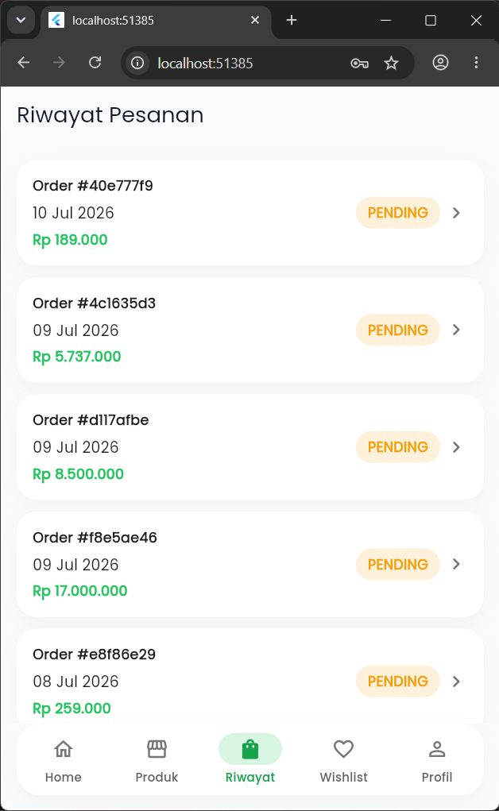
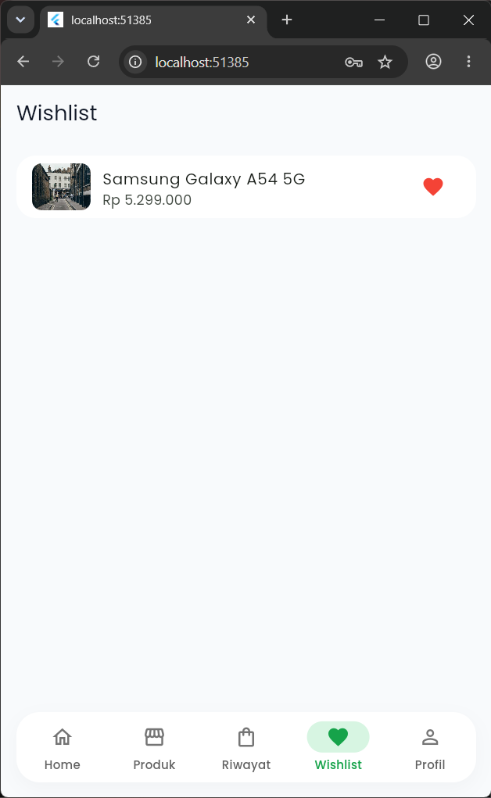
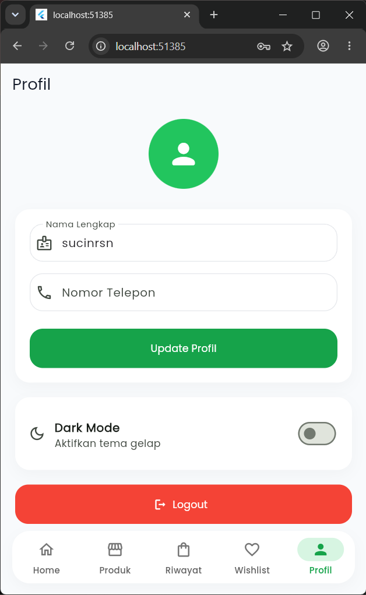
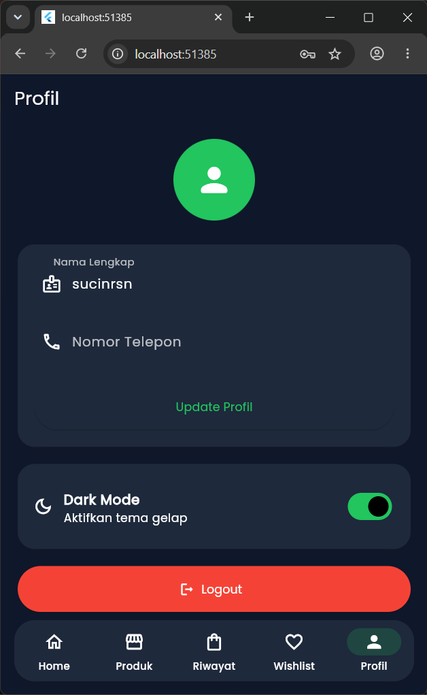
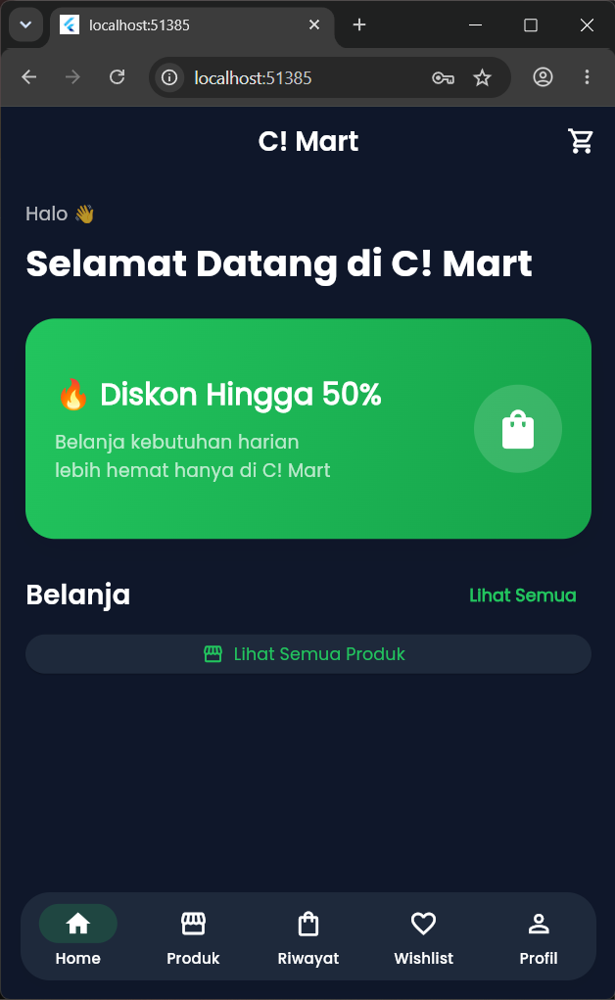

# 🛒 UAS Mobile - Aplikasi E-Commerce

Aplikasi E-Commerce berbasis Flutter yang dikembangkan sebagai proyek Ujian Akhir Semester (UAS). Aplikasi ini terintegrasi dengan REST API menggunakan Express.js dan Supabase sebagai database.

## 📱 Fitur

- Login dan Register
- Menampilkan daftar produk
- Detail produk
- Keranjang belanja
- Checkout pesanan
- Riwayat pesanan
- Profil pengguna
- Edit profil
- Logout

## 🛠️ Teknologi

### Frontend
- Flutter
- Dart
- Dio
- Shared Preferences

### Backend
- Node.js
- Express.js
- Supabase
- JWT Authentication

## 🌐 REST API

Backend menggunakan REST API yang di-deploy menggunakan Railway.

Base URL:

```text
https://api-tb-production-a116.up.railway.app/api
```

Dokumentasi API:

```text
https://api-tb-production-a116.up.railway.app/api-docs
```

## 📦 APK

File APK dapat diunduh melalui halaman **Releases** pada repository GitHub.

## 🚀 Cara Menjalankan Project

1. Clone repository

```bash
git clone https://github.com/sucinursania/uas_mobile.git
```

2. Masuk ke folder project

```bash
cd uas_mobile
```

3. Install dependency

```bash
flutter pub get
```

4. Jalankan aplikasi

```bash
flutter run
```

## 📂 Struktur Folder

```
lib/
│── models/
│── pages/
│── providers/
│── services/
│── theme/
│── utils/
│── widgets/
│── main.dart
```

## 👩‍💻 Developer

**Suci Nursania**

Teknik Informatika  
Institut Teknologi Garut

---

**Project UAS Mobile Programming**









